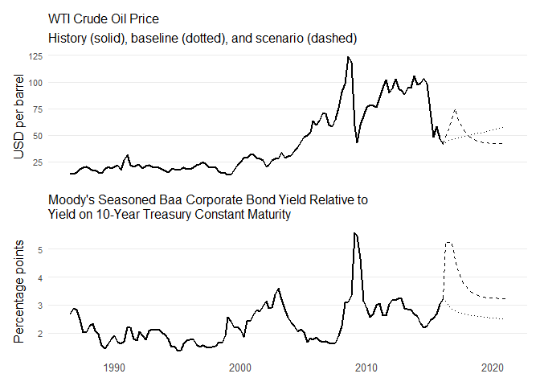
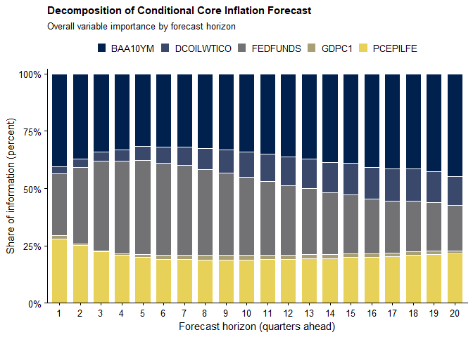
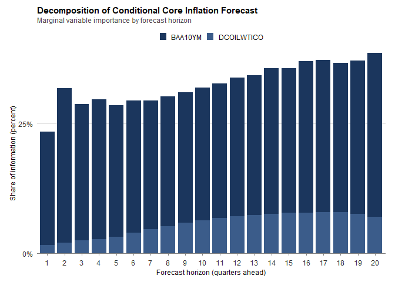
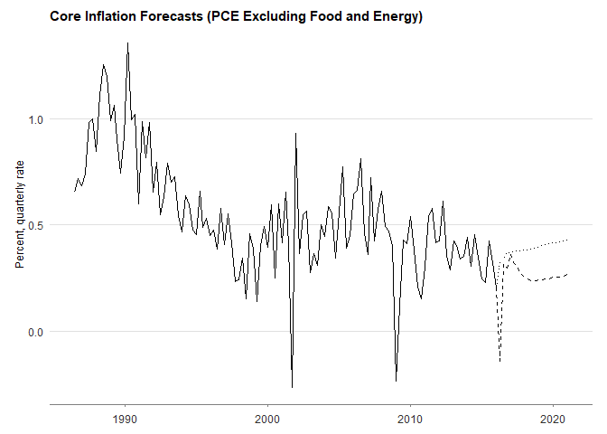
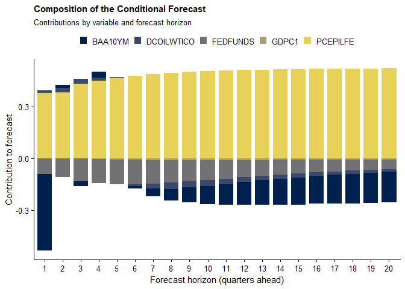

<!-- README.md is generated from README.Rmd. Please edit that file -->

# cforecast

**cforecast** is an R package for conditional forecasting and scenario
analysis in vector autoregressive (VAR) models. It implements a Kalman
filter–based framework for generating forecasts conditional on
user-specified future paths of observable variables and provides tools
for decomposing and interpreting scenario-driven forecast revisions.

The example below replicates an empirical experiment from:

> Caspi, I., & Ginker, T. (2026). *Conditional Forecasting with VARs:
> Dynamic Influence, Variable Importance, and Forecast
> Interpretation*.  
> <https://doi.org/10.13140/RG.2.2.25225.51040>

The illustration demonstrates the workflow for scenario design,
conditional forecasting, and forecast attribution.

------------------------------------------------------------------------

## Installation

Install the development version from GitHub:

``` r
# install.packages("devtools")
devtools::install_github("timginker/cforecast")
```

## Empirical Illustration: Conditional Inflation Forecasting under Financial and Energy Price Scenarios

This section demonstrates how the conditional forecasting tools in
`cforecast` can be used to:

1.  Assess *ex ante* which conditioning assumptions are likely to
    materially affect a target forecast.
2.  Attribute *ex post* forecast revisions to specific elements of a
    multi-period conditioning path.

We consider a stylized policy scenario combining:

- A tightening in financial conditions (corporate credit spreads), and  
- A temporary oil price disruption.

Such scenarios are typical in monetary policy and macro-financial
stress-testing applications.

------------------------------------------------------------------------

We use U.S. quarterly macroeconomic data (1986Q2–2015Q4) from FRED.  
The dataset includes the following series:

- **GDPC1** — Real GDP  
- **PCEPILFE** — Core PCE price index  
- **FEDFUNDS** — Federal funds rate  
- **BAA10YM** — Corporate credit spread (Moody’s Baa minus 10-year
  Treasury)  
- **DCOILWTICO** — WTI crude oil price

The VAR includes five variables:

1.  Real GDP growth  
2.  Core PCE inflation  
3.  Federal funds rate  
4.  Corporate credit spread  
5.  Oil price

Below, we estimate a reduced-form VAR(2) with a constant term and
compute a 20-quarter baseline (unconditional) forecast.

------------------------------------------------------------------------

``` r
suppressPackageStartupMessages({
library(cforecast)
library(tidyverse)
library(vars)
library(lubridate)
library(scales)
library(patchwork)
})

# Load packaged dataset
data(fred_macro)
data("DCOILWTICO_level")

# Restrict estimation sample
df <- fred_macro %>%
  filter(year(date) >= 1986,
         year(date) <= 2015)

# Estimate VAR(2)
fit <- VAR(df[, -1], p = 2, type = "const")

# Baseline forecast
pred_base <- predict(fit, n.ahead = 20)
```

------------------------------------------------------------------------

## Scenario Design

We construct a two-variable conditioning path affecting:

- The corporate credit spread (BAA10YM)  
- The oil price (DCOILWTICO)

The scenario is designed as follows:

- **Credit spreads** increase by 200 basis points for three quarters and
  then gradually decay back toward baseline.
- **Oil prices** initially surge and then revert gradually.

This structure mimics a temporary macro-financial stress episode with
persistent but fading effects.

The following plot creates the scenario and plots it:

``` r
# Slicing Oil data
DCOILWTICO_level %>% 
  mutate(date = as.Date(date)) %>% 
  dplyr::filter(year(date) >= 1986, year(date) <= 2015) %>% 
  slice(-1) -> DCOILWTICO_level

# Baseline path for oil prices (reconstructed in levels)
pred_base <- predict(fit, n.ahead = 20)
oil_base <- rep(NA, 20)
oil_base[1] <- tail(DCOILWTICO_level$DCOILWTICO, 1) *
  (1 + pred_base$fcst$DCOILWTICO[1, 1] / 100)

for (i in 2:20) {
  oil_base[i] <- oil_base[i - 1] *
    (1 + pred_base$fcst$DCOILWTICO[i, 1] / 100)
}

# Imposed scenario paths for credit spreads and oil prices
delta <- 0.7
BAA10YM_future <- c(
  rep(tail(df$BAA10YM, 1) + 2, 3),
  (tail(df$BAA10YM, 1) + 2 * delta^(1:17))
)

DCOILWTICO_future <- c(
  tail(DCOILWTICO_level$DCOILWTICO, 1) * (1.155061^(1:4)),
  tail(DCOILWTICO_level$DCOILWTICO, 1) + 33.06 * delta^(1:16)
)

# Extended date vector covering the forecast horizon
dates_0 <- fred_macro$date[1:(nrow(df) + 20)]

# Construct plotting data for the credit-spread scenario input:
#   - y: historical series (in-sample)
#   - y_base: baseline (unconditional) VAR forecast appended after the sample end
#   - y_fcst: imposed scenario path appended after the sample end
# Missing values are used to prevent ggplot from drawing lines outside the
# intended segments (history vs forecast).

df_plot <- data.frame(
  date = dates_0,
  y = c(df$BAA10YM, rep(NA,length(BAA10YM_future))),
  y_base = c(rep(NA,nrow(df)-1),
             tail(df$BAA10YM,1),pred_base$fcst$BAA10YM[,1]),
  y_fcst = c(rep(NA,nrow(df)-1),
             tail(df$BAA10YM,1),BAA10YM_future)
)

# Plot the credit-spread path:
# Solid line: historical data
# Dashed line: imposed scenario path used for conditioning
# Dotted line: baseline path implied by the VAR
p_baa <- ggplot(df_plot, aes(x = date)) +
  geom_line(aes(y = y), color = "black", linewidth = 0.8) +
  geom_line(
    aes(y = y_fcst),
    color = "black",
    linewidth = 0.7,
    linetype = "dashed"
  ) +
  geom_line(
    aes(y = y_base),
    color = "black",
    linewidth = 0.7,
    linetype = "dotted"
  )+
  labs(
    title = "Moody's Seasoned Baa Corporate Bond Yield Relative to \nYield on 10-Year Treasury Constant Maturity",
    #caption = "Notes: The solid line shows historical data. The dashed line denotes the conditional \nforecast under the imposed scenario. The dotted line shows the unconditional (baseline) forecast.",
    x = NULL,
    y = "Percentage points"
  ) +
  theme_minimal(base_size = 12) +
  theme(
    panel.grid.minor = element_blank(),
    panel.grid.major.x = element_blank(),
    plot.title = element_text(size = 12),
    axis.text.y = element_text(size = 8)
    #plot.title = element_text(face = "bold")
  )


# Construct plotting data for the oil price scenario input (in levels):
#   - y: historical oil price (levels series)
#   - y_fcst: imposed scenario oil price path in levels
#   - y_base: baseline oil price path reconstructed from VAR forecasts
# As above, NA padding separates the historical segment from forecast segments.

df_plot_oil <- data.frame(
  date = dates_0,
  y = c(DCOILWTICO_level$DCOILWTICO, rep(NA,length(DCOILWTICO_future))),
  y_fcst = c(rep(NA,nrow(df)-1), 
             tail(DCOILWTICO_level$DCOILWTICO,1),DCOILWTICO_future),
  y_base = c(rep(NA,nrow(df)-1), 
             tail(DCOILWTICO_level$DCOILWTICO,1),oil_base)
)

# Plot the oil price path:
# Solid line: historical data
# Dashed line: imposed scenario path used for conditioning
# Dotted line: baseline path implied by the VAR (in levels)
p_oil <- ggplot(df_plot_oil, aes(x = date)) +
  geom_line(aes(y = y), color = "black", linewidth = 0.8) +
  geom_line(
    aes(y = y_fcst),
    color = "black",
    linewidth = 0.7,
    linetype = "dashed"
  ) +
  geom_line(
    aes(y = y_base),
    color = "black",
    linewidth = 0.7,
    linetype = "dotted"
  )+
  labs(
    title = "WTI Crude Oil Price",
    subtitle = "History (solid), baseline (dotted), and scenario (dashed)",
    x = NULL,
    y = "USD per barrel"
  ) +
  theme_minimal(base_size = 12) +
  theme(
    panel.grid.minor = element_blank(),
    panel.grid.major.x = element_blank(),
    plot.title = element_text(size = 12),
    axis.text.y = element_text(size = 8)
  )


# Align x-axis limits across the two panels to ensure consistent time coverage
# and facilitate direct visual comparison of the two conditioning paths.
x_rng <- range(c(df_plot_oil$date, df_plot$date), na.rm = TRUE)

# Combine the two scenario-input panels into a single figure:
# Oil price on top; credit spread below. X-axis annotations are removed from
# the top panel to avoid duplication and improve readability.
combined_plot_scenarios <-
  (p_oil + scale_x_date(limits = x_rng) +
     theme(axis.title.x = element_blank(),
           axis.text.x  = element_blank(),
           axis.ticks.x = element_blank())) /
  (p_baa + scale_x_date(limits = x_rng))


suppressWarnings(combined_plot_scenarios)
```



------------------------------------------------------------------------

## Interpreting Variable Importance

We begin by examining overall variable importance in the conditional
forecast of core inflation. These measures are computed *ex ante*, given
the conditioning design: the future paths of the corporate credit spread
(Moody’s Baa–10Y Treasury spread) and WTI crude oil prices are
constrained, while the remaining variables are left unconstrained.

The decomposition therefore quantifies the relative contribution of:

1.  The imposed conditioning paths, and  
2.  Historical information embedded in the data.

Importantly, this assessment does not require realized future values.

The plot below reports the overall variable importance:

``` r
v_imp=variable_importance_stat(fit=fit,
                               cond_var = 4:5,
                               target_var = 2,
                               horizon = 20)

# Visualize variable importance as stacked shares by horizon (normalized to 100%)
plt = ggplot(v_imp$variable_importance,
             aes(x = factor(horizon),
                 y = share,
                 fill = variable)) +
  geom_col(position = "fill", width = 0.75, color = "white", linewidth = 0.2) +
  scale_y_continuous(
    labels = percent_format(accuracy = 1),
    expand = expansion(mult = c(0, 0.02))
  ) +
  scale_fill_viridis_d(option = "cividis", end = 0.9) +
  labs(
    title = "Decomposition of Conditional Core Inflation Forecast",
    subtitle = "Overall variable importance by forecast horizon",
    x = "Forecast horizon (quarters ahead)",
    y = "Share of information (percent)",
    fill = NULL
  ) +
  theme_classic(base_size = 12) +
  theme(
    plot.title = element_text(face = "bold", size = 11),
    plot.subtitle = element_text(size = 10),
    axis.title = element_text(size = 11),
    axis.text  = element_text(size = 10),
    legend.position = "top",
    legend.text = element_text(size = 10),
    legend.key.size = unit(0.35, "cm"),
    axis.line = element_line(linewidth = 0.3),
    axis.ticks = element_line(linewidth = 0.3)
  )

plt 
```



The results indicate that the importance of the credit spread increases
steadily with the forecast horizon. This pattern suggests that financial
conditions—particularly corporate credit risk—play an increasingly
prominent role in shaping medium-term inflation dynamics. This finding
is consistent with evidence that credit spreads contain predictive
information for demand-side pressures (e.g., Lopez-Salido et al., 2017;
Caldara and Herbst, 2019).

By contrast, oil prices contribute more modestly to the core inflation
forecast. Their importance rises slightly at longer horizons—an
intuitive result given that core inflation excludes energy components
and oil affects inflation only indirectly through production costs and
aggregate demand.

The federal funds rate, although unconstrained in the scenario,
contributes through its historical values. Its importance peaks at a lag
of roughly five quarters, consistent with standard estimates of monetary
policy transmission (e.g., Christiano et al., 1996).

Finally, GDP growth receives minimal weight in the decomposition. This
reflects its weak marginal signal once financial and commodity variables
are accounted for and aligns with evidence that real activity indicators
offer limited incremental predictive content for inflation (Stock and
Watson, 2007).

------------------------------------------------------------------------

## Marginal Variable Importance

The plot below reports the marginal importance:

``` r

plt_mimp = ggplot(subset(v_imp$marginal_variable_importance,share!=0),
             aes(x = factor(horizon),
                 y = share,
                 fill = variable)) +
  geom_col(position = "fill", width = 0.75, color = "white", linewidth = 0.2) +
  scale_y_continuous(
    labels = percent_format(accuracy = 1),
    expand = expansion(mult = c(0, 0.02))
  ) +
  scale_fill_viridis_d(option = "cividis", end = 0.9) +
  labs(
    title = "Decomposition of Conditional Core Inflation Forecast",
    subtitle = "Marginal variable importance by forecast horizon",
    x = "Forecast horizon (quarters ahead)",
    y = "Share of information (percent)",
    fill = NULL
  ) +
  theme_classic(base_size = 12) +
  theme(
    plot.title = element_text(face = "bold", size = 11),
    plot.subtitle = element_text(size = 10),
    axis.title = element_text(size = 11),
    axis.text  = element_text(size = 10),
    legend.position = "top",
    legend.text = element_text(size = 10),
    legend.key.size = unit(0.35, "cm"),
    axis.line = element_line(linewidth = 0.3),
    axis.ticks = element_line(linewidth = 0.3)
  )


plt_mimp
```



Marginal variable importance isolates the contribution of the imposed
future constraints. The decomposition is dominated by the corporate
credit spread, while oil prices gain importance gradually at longer
horizons due to their indirect and lagged transmission to core
inflation.

Taken together, the overall and marginal importance measures highlight
an important distinction:

- **Overall importance** reflects both historical information and
  imposed paths.  
- **Marginal importance** isolates the incremental role of future
  constraints.

The results emphasize the dominant role of the credit spread in shaping
the conditional inflation forecast and the delayed, indirect influence
of oil prices.

------------------------------------------------------------------------

------------------------------------------------------------------------

## Creating and Analyzing Conditional Forecasts

After examining the dynamic relationships estimated by the VAR and their
implications for scenario transmission, we proceed to generate a
conditional forecast.

Creating a conditional forecast requires:

- A fitted VAR model  
- A matrix containing the imposed future paths (`cond_path`)  
- The indices of the constrained variables (`cond_var`)

The code below illustrates the implementation:

``` r
# Construct conditioning matrix
cond_path <- cbind(BAA10YM_future, DCOILWTICO_future)

# Generate conditional forecast
fct_constr <- cforecast(
  fit,
  cond_path = cond_path,
  cond_var  = 4:5
)
```

The object `fct_constr` contains the full conditional forecast,
including the projected paths of all variables in the system consistent
with the imposed scenario.

The figure below illustrates the conditional forecast of core inflation
under the assumed scenario. The imposed widening in the corporate credit
spread generates a pronounced disinflationary impulse at short horizons.
Within the reduced-form VAR, this shock is accompanied by an implied
accommodative response of the policy rate.

The contribution of oil prices increases gradually over the forecast
horizon, reflecting the indirect transmission of energy-cost shocks to
core inflation through production costs and aggregate demand. By
contrast, the initial spike in the credit spread produces a sharp
negative effect that subsequently stabilizes at a moderate level. This
pattern is consistent with the scenario design, in which spreads revert
toward a slightly higher plateau rather than continuing to widen.

``` r
# Build a plotting data set for core inflation with history and both forecasts
df_plot_infl = data.frame(
  date = dates_0,
  y = c(df$PCEPILFE, rep(NA,length(BAA10YM_future))),
  y_base = c(rep(NA,nrow(df)-1),
             tail(df$PCEPILFE,1),pred_base$fcst$PCEPILFE[,1]),
  y_fcst = c(rep(NA,nrow(df)-1),
             tail(df$PCEPILFE,1),fct_constr$forecast[,2])
)

# Plot historical inflation and the conditional/unconditional forecasts
plt_fct_scenarios <-ggplot(df_plot_infl, aes(x = date)) +
  geom_line(aes(y = y), color = "black", linewidth = 0.8) +
  geom_line(
    aes(y = y_fcst),
    color = "black",
    linewidth = 0.7,
    linetype = "dashed"
  ) +
  geom_line(
    aes(y = y_base),
    color = "black",
    linewidth = 0.7,
    linetype = "dotted"
  ) +
  labs(
    title = "Core Inflation Forecasts (PCE Excluding Food and Energy)",
    #subtitle = "Conditional and unconditional projections",
    x = NULL,
    y = "Percent, quarterly rate",
    caption = "Notes: The solid line shows historical core PCE inflation. The dashed line denotes the conditional \nforecast under the imposed scenario. The dotted line shows the unconditional (baseline) forecast."
  ) +
  theme_minimal(base_size = 12) +
  theme(
    panel.grid.minor = element_blank(),
    panel.grid.major.x = element_blank(),
    plot.title = element_text(face = "bold", size = 11),
    plot.subtitle = element_text(size = 10),
    axis.text.y = element_text(size = 8),
    axis.text.x = element_text(size = 9),
    plot.caption = element_text(
      hjust = 0,
      size = 9,
      color = "grey30"
    )
  )

suppressWarnings(plt_fct_scenarios)
```



------------------------------------------------------------------------

## Decomposing the Conditional Forecast into Variable-Specific Contributions

The composition of a conditional forecast can be obtained using
`cforecast_composition()`. The function decomposes the scenario-induced
forecast revision for a chosen target variable into contributions from
each conditioning variable.

``` r
fct_comp <- cforecast_composition(
  fct_constr,
  target_var = 2
)
```

To visualize the decomposition across forecast horizons:

``` r
# Add explicit horizon index
fct_comp$horizon <- 1:20

# Reshape to long format
df_long <- fct_comp %>%
  pivot_longer(
    cols      = -horizon,
    names_to  = "variable",
    values_to = "contribution"
  )

# Plot stacked contributions by horizon
ggplot(
  df_long,
  aes(x = factor(horizon),
      y = contribution,
      fill = variable)
) +
  geom_col(width = 0.8) +
  labs(
    title = "Composition of the Conditional Forecast",
    subtitle = "Contributions by variable and forecast horizon",
    x = "Forecast horizon (quarters ahead)",
    y = "Contribution to forecast",
    fill = NULL
  ) +
  scale_fill_viridis_d(option = "cividis", end = 0.9) +
  theme_classic(base_size = 12) +
  theme(
    plot.title    = element_text(face = "bold", size = 11),
    plot.subtitle = element_text(size = 10),
    axis.title    = element_text(size = 11),
    axis.text     = element_text(size = 10),
    legend.position = "top",
    legend.text     = element_text(size = 10),
    legend.key.size = unit(0.35, "cm")
  )
```



The decomposition clarifies the sources of the scenario-driven forecast
revision. Although oil prices contribute visibly to the forecast
composition, the variable-importance measures indicate that this effect
is largely driven by the magnitude of the imposed oil-price path rather
than by a strong model-implied sensitivity of core inflation to oil
prices.

This distinction is economically important.

In scenarios that impose mechanically specified or stylized paths,
variable-importance measures provide an *ex ante* indication of whether
those assumptions are likely to materially affect the target forecast.
More broadly, the decomposition helps discipline scenario design and
interpretation by distinguishing between:

- Effects arising from strong model-implied linkages, and  
- Effects driven primarily by large imposed deviations.

This directly informs policy communication. It identifies the pivotal
elements of the narrative and highlights which imposed details are
economically consequential for the variables of interest.

------------------------------------------------------------------------

# Disclaimer

The views expressed here are solely of the author and do not necessarily
represent the views of the Bank of Israel.

Please note that `cforecast` is still under development and may contain
bugs or other issues that have not yet been resolved. While we have made
every effort to ensure that the package is functional and reliable, we
cannot guarantee its performance in all situations.

We strongly advise that you regularly check for updates and install any
new versions that become available, as these may contain important bug
fixes and other improvements. By using this package, you acknowledge and
accept that it is provided on an “as is” basis, and that we make no
warranties or representations regarding its suitability for your
specific needs or purposes.
